

{ width="300" }
/// caption
(2026/02/06: Particle detector workshop)
///

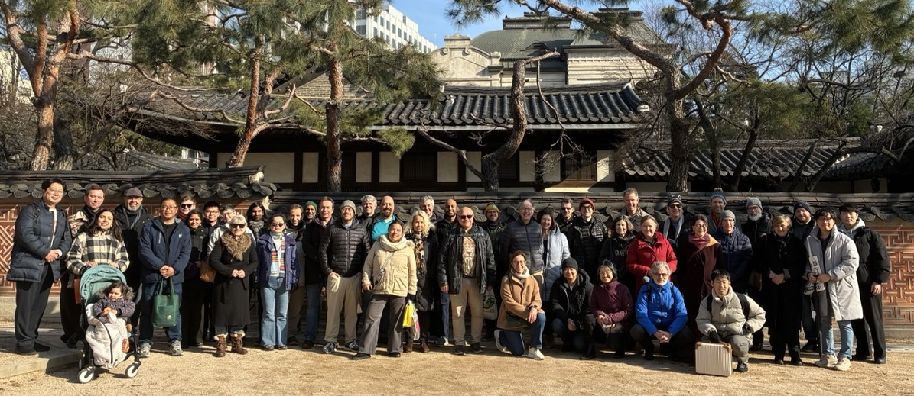{ width="300" }
/// caption
(2025/12/12: CMS week in Korea)
///

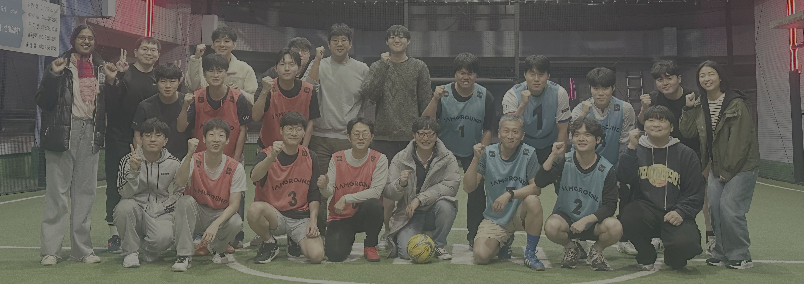{ width="300" }
/// caption
(2025/11/11: Futsal with 유재혁 교수님 연구실, 김태정 교수님 (한양대) 연구실)
///

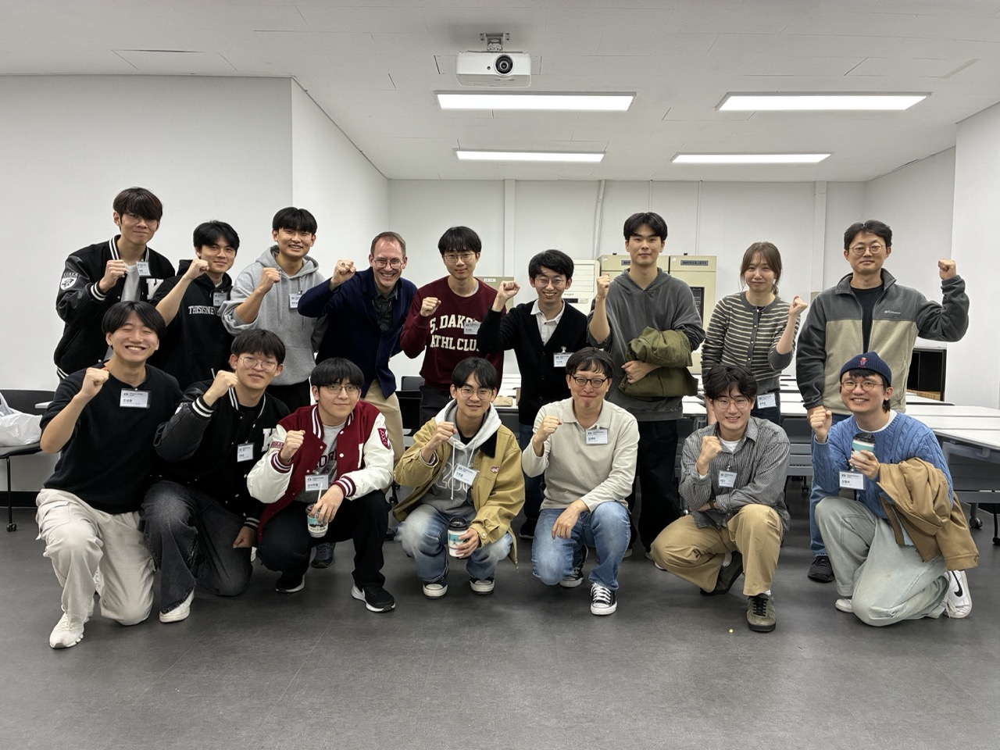{ width="300" }
/// caption
(2025/10/31: Physics coffee hour)
///

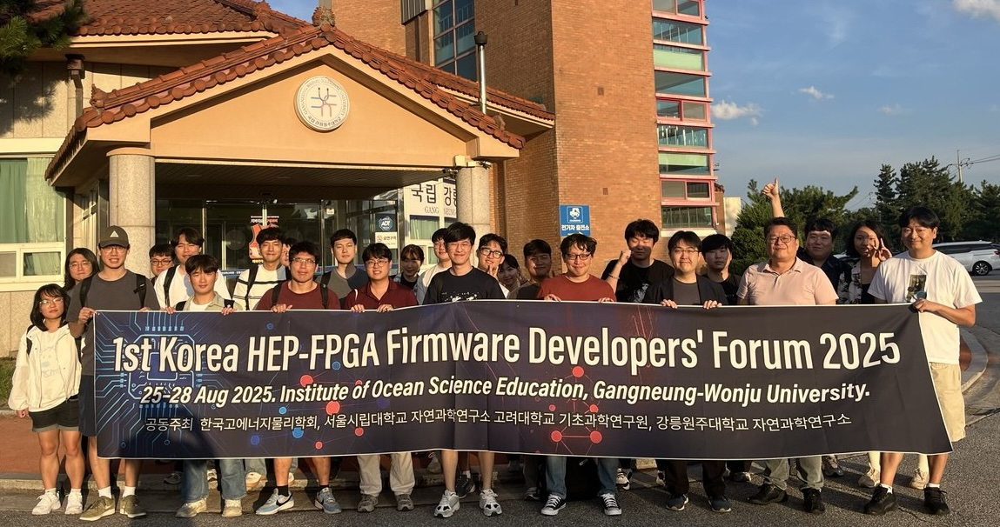{ loading=lazy width="300" }
/// caption
(2025/08/25: FPGA workshop at 강릉)
///

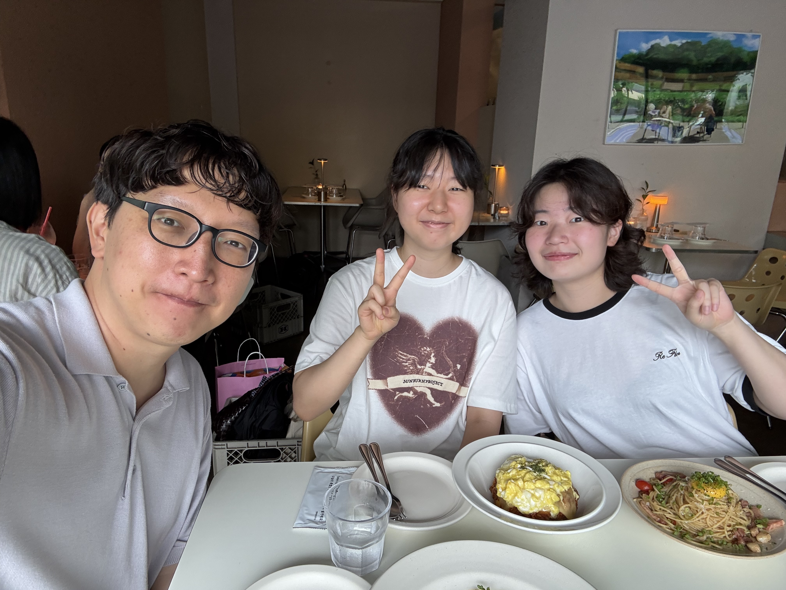{ loading=lazy width="300" }
/// caption
(2025/08/14: Lunch with 남재현, 강미림)
///

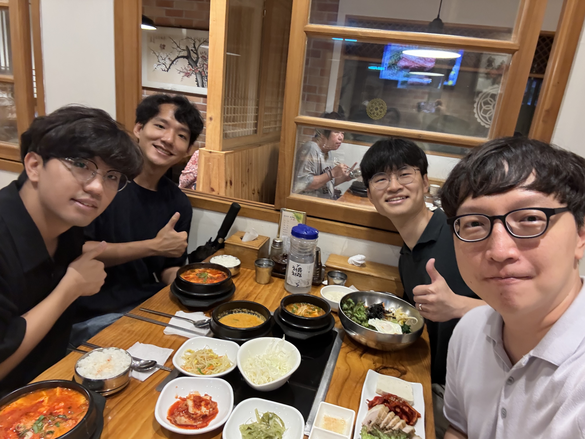{ loading=lazy width="300" }
/// caption
(2025/08/13: Lunch with 박주강, 오준원, 조성범)
///

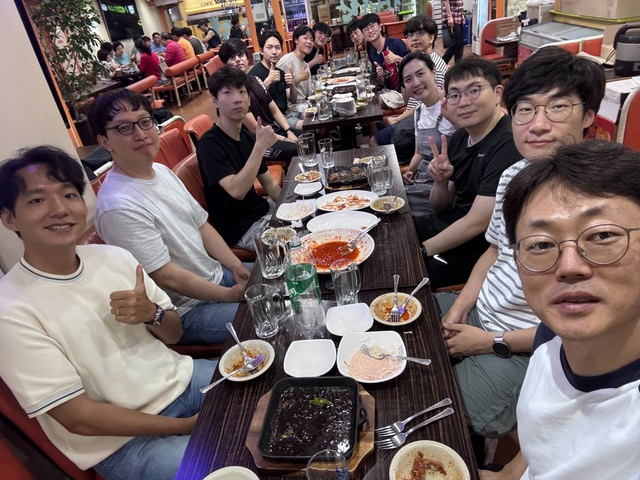{ width="300" }
/// caption
(2025/08/06: Dinner with 유재혁 교수님 연구실)
///

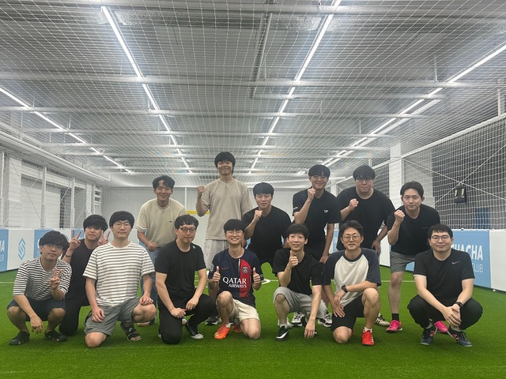{ width="300" }
/// caption
(2025/08/06: Futsal with 유재혁 교수님 연구실)
///

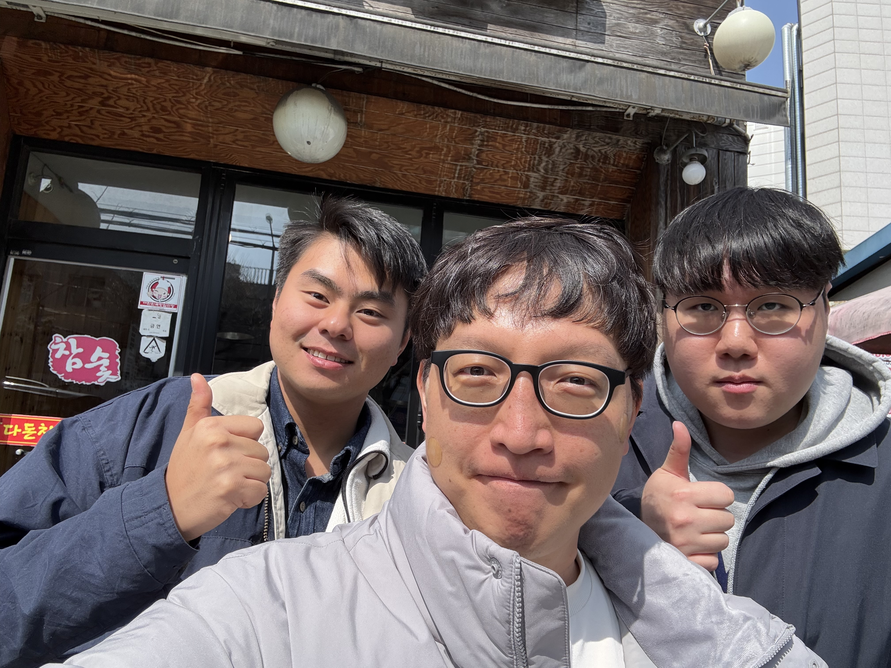{ width="300" }
/// caption
(2025/03/14: Lunch with 김민서 and 강세준)
///

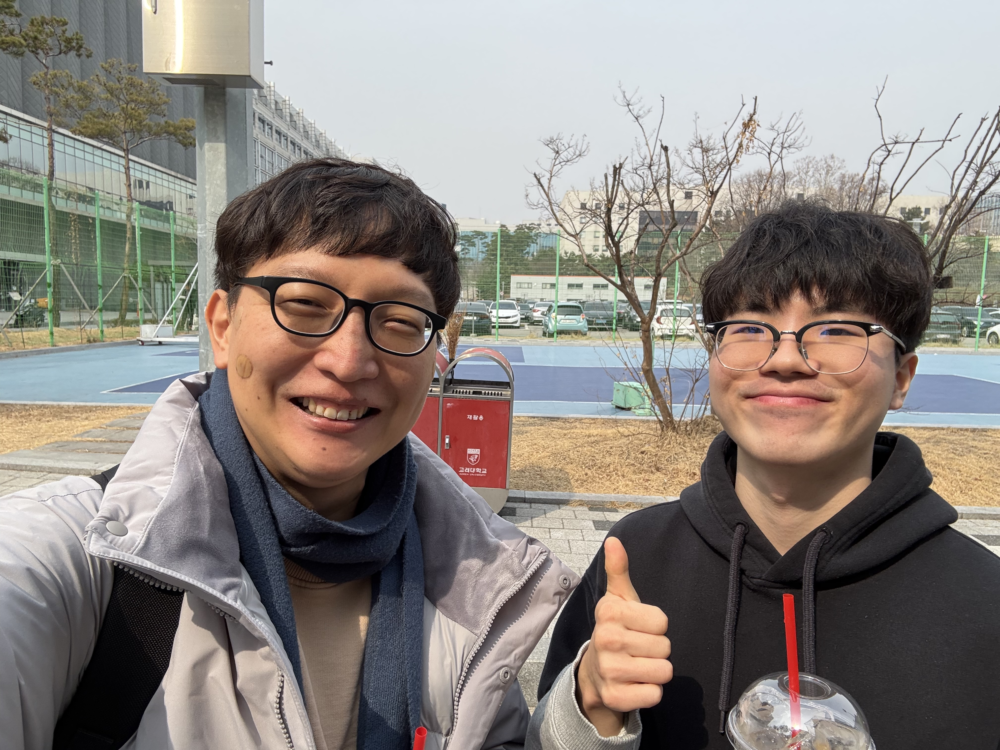{ width="300" }
/// caption
(2025/03/07: Lunch with 송준혁)
///

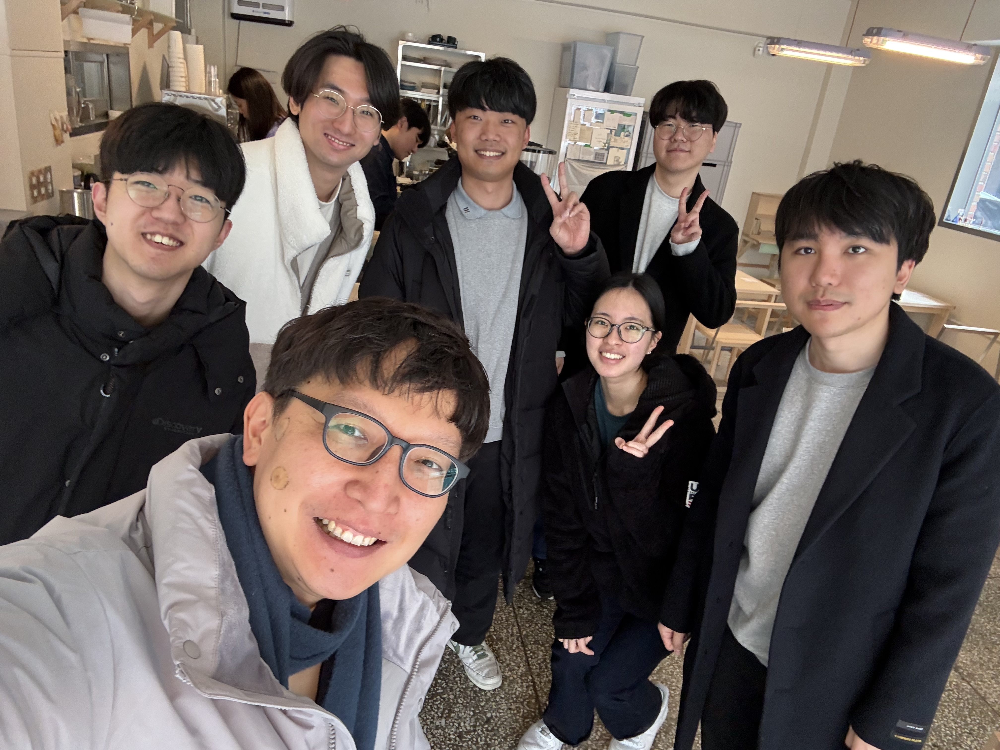{ width="300" }
/// caption
(2025/03/06: Lunch with FUNDAMENTAL PHYSICS LAB.Ⅱ TA's)
///

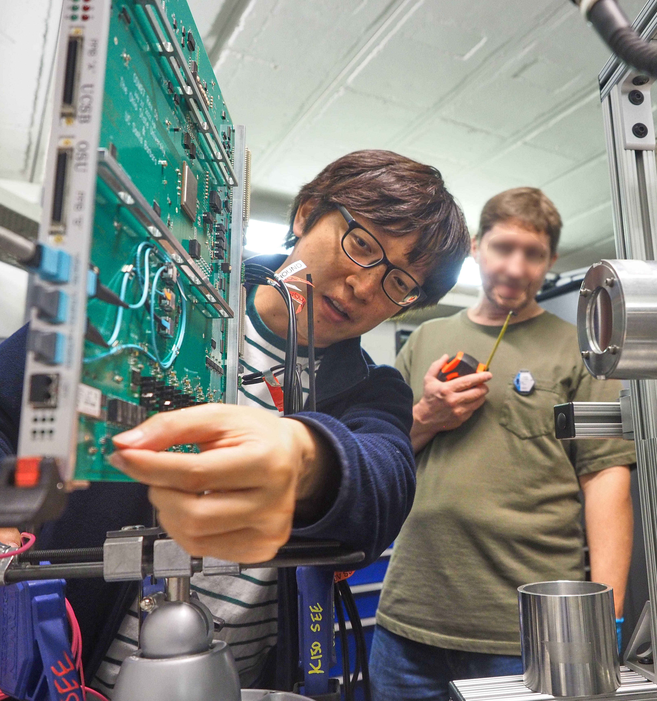{ width="300" }
/// caption
(2023) Jaebak Kim measuring radiation effects at Texas A&M University Cyclotron 
///

