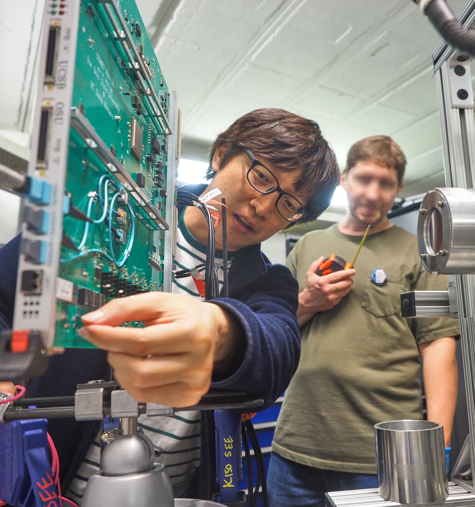

# Welcome to the Korea Univeristy Experimental Particle Physics DREAM group

{ width="300" }
/// caption
Measuring radiation effects at Texas A&M University Cyclotron 
///

Welcome to the Korea University Particle Physics DREAM (Design, Realize, Experiment, Analysis, Measurement) Group.
The group **probes fundamental questions in particle physics with experiments**. 

## CMS experiment
Our group is investigating particle physics with the CMS (Compact Muon Solenoid) experiment.

**Particle physics questions** that are being probed.

- Why is the **Higgs boson** mass (125 GeV) light compared to it's high energy corrections ($10^{19}$ GeV)?
- What is the physics of **dark matter**? 
- Are there unknown particles that couple with the Higgs boson?
- What is the shape of the Higgs potential that determines the fate of the universe?
- What is the source of the **matter anti-matter asymmetry** observed in the universe?

**Technical** explaination of the experiement, where one can develop and get experience on these technologies.

1. Particles are created by **accelerating protons** to collide with each other at **high energies (13-14 TeV)**.
1. These particles pass through **silicon, scintillator, and gas detectors** which create electric pulses.
1. The detector electric pulses are digitized through **ASIC chips and electronic boards**.
1. Quick (0.000004 second) **firmware (FPGA) triggers** are used to select the digitized detector data to store.
1. Data is stored through **high speed (4 Tb/s) Data Acquisition (DAQ)** using **optical transceivers**.
1. The **Big Data (100 Petabyte)** is processed with **cloud of (10,000) servers** around the globe.
1. Measurements are made by **analyzing data with software**, where **statistical methods** and **machine learning** techniques such as **artificial intelligence** are used.
1. **Monitoring software** is used to **continuously check** the status of the detector and servers.

## Research interests

### Year 2025

| CMS physics data analysis | Motivation | 
| ---- | ---- |
| Higgs boson decaying to a Z boson and photon | Are there unknown particles effecting this decay? |
| Higgsino decaying to a Higgs boson and Neutralino | Do SUSY particles (Higgsino, Neutralino) exist? |
| | |
| **Technology development** | |
| Transformer neural network | Using Large Language Model network structures in Particle Physics | 
| Firmware (FPGA) | For efficient triggering and high speed DAQ | 

## Group leader's (Jaebak Kim) biography

| Year | Title | Location | 
| ---- | ---- | ---- |
| 2025 - 2025 | **Assistant Professor of Physics** | Korea University | 
| 2019 - 2025 | **Researcher in Particle Physics in CMS experiment** | University of California, Santa Barbara | 
| | (2024) [Training toward significance with the decorrelated event classifier transformer neural network](https://journals.aps.org/prd/abstract/10.1103/PhysRevD.109.096035) | Sole author paper | 
| | (2024) [Combined search for electroweak production of winos, binos, higgsinos, and sleptons in proton-proton at sqrt(s) = 13 TeV](https://journals.aps.org/prd/abstract/10.1103/PhysRevD.109.112001) | Primary author paper | 
| | (2023) Acting CMS Muon Upgrade Coordinator | | 
| | (2022) [Search for higgsinos decaying to two Higgs bosons and missing transverse momentum in proton- proton collisions at sqrt(s) = 13 TeV](https://link.springer.com/article/10.1007/JHEP05(2022)014) | Primary author paper |
| | (2021) CMS Supersymmetry sub-group convener | | 
| | (2019) CMS Cathode Strip Chamber Upgrade Coordinator | |
| 2018 - 2019 | **Researcher in Particle Physics in Belle/Belle II experiment** | Korea University |
| | (2019) [Search for CP violation with Kinematic Asymmetries in the D0 → K+K−π+π− Decay](https://journals.aps.org/prd/abstract/10.1103/PhysRevD.99.011104) | First author paper | 
| 2012 - 2018 | **Doctor in Particle Physics in Belle/Belle II experiment** | Korea University | 
| | Search for CP violation using T-odd correlations in the D0 → K+K−π+π− decay | Thesis | 
| | (2018) [Three dimensional fast tracker for central drift chamber based level 1 trigger system in the Belle II ex- periment](https://link.springer.com/article/10.3938/jkps.72.33) | Corresponding author paper|
| | (2017) [A software framework for pipelined arithmetic algorithms in field programmable gate arrays](https://www.sciencedirect.com/science/article/abs/pii/S0168900217312974?via%3Dihub) | First author paper |
| 2010 - 2012 | **Master in Particle Physics in Belle/Belle II experiment** | Korea University | 
| | A 3-dimensional fast fitter for central drift chamber (CDC) based level 1 trigger system in the Belle II experiment | Thesis | 
| 2002 - 2010 | **Bachelor in Physics** | Korea University |

## Global collaboration

| Institute | Country | Topic |
| ---- | ---- |  ---- | 
| University of California, Santa Barbara | USA | Higgs, SUSY, DAQ |
| University of Colorado Boulder | USA |  SUSY |
| Northeastern University | USA | DAQ |
| Cornell University | USA | Higgs |
| University of Bari | Italy | Gas detectors |
| KEK | Japan | Trigger |

## Contact

Please contact Jaebak Kim (jaebak.kim at cern.ch) in English or Korean, if you are interested in **particle physics, technology**, and the DREAM group,
where the group is **open to all universities** around the globe. 
(High school students are also welcome to contact to discuss about future hopes.)
The **goal** is to expose the next generation to **interesting opportunities**
in experimental particle physics and help them **become independent researchers that DREAM**.
