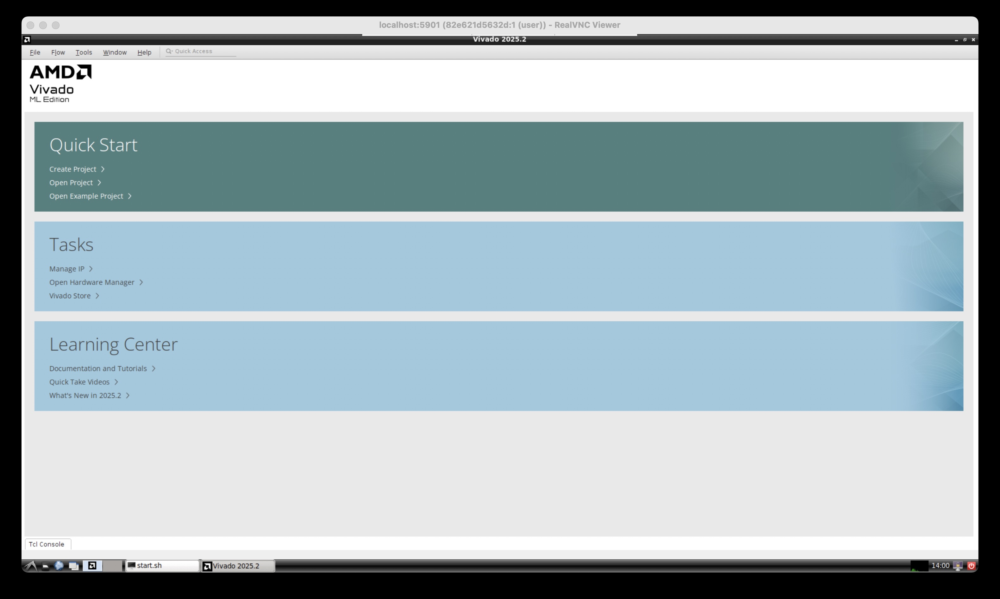

### Goal

Run Vivado 2025.2 on Apple silicon with MacOS 15 and connect to FPGA using Mac's USB.

{width="600"}

### Method

1. Run a Ubuntu 22.04 docker container to run Vivado which utilizes Rosetta. 
2. Use `openfpgaloader` to connect Mac's USB with Vivado, which utilizes `xvc`.

Note that it will requires over 64 GB of disk space. 
Can use an external usb drive for the disk space.

### Installation Steps
1. Install docker
2. Build Ubuntu 22.04 image 
3. Install Vivado in folder
4. Make scripts to run Vivado automatically
5. Install cable application on MacOS
6. Install vncviewer

There will be two folders used in installation.

  - `WORK_DIR`: Folder used when running vivado. Requries few GB of disk space.
  - `INSTALL_DIR`: Folder that holds vivado. Requires over 64 GB of disk space.

To make it easy to change path, we can set environment variable, where below is an example

```
export WORK_DIR=~/my_work
export INSTALL_DIR=/Volumes/my_usb/xilinx
```

#### 1. Install docker
A. Install Rosetta

`softwareupdate --install-rosetta --agree-to-license`

B. Download docker from [https://desktop.docker.com/mac/main/arm64/Docker.dmg](https://desktop.docker.com/mac/main/arm64/Docker.dmg)

C. Run docker application to complete installation. Can select recommended settings.

D. Increase container SWAP setting in docker settings

  - Settings -> Resources -> Swap: 4 GB

#### 2. Build Ubuntu 22.04 image

A. Go to a work folder

```
mkdir $WORK_DIR
cd $WORK_DIR
```

B. Create Dockerfile to make image

```
cat > Dockerfile <<EOF
# Container for running Vivado
FROM --platform=linux/amd64 ubuntu:22.04
RUN apt-get update && apt-get upgrade -y

# Fix the error of build failing due to not having the frontend installed
# This enviroment auto fallbacks to noninteractive mode, with the declaration following this guidance:
# https://bobcares.com/blog/debian_frontendnoninteractive-docker/
# https://github.com/moby/moby/issues/4032#issuecomment-34597177
ARG DEBIAN_FRONTEND=noninteractive

# Check and install ca-certificates earlier if Rosetta gets broken
RUN apt -y install ca-certificates

# install gui
RUN apt-get install -y --no-install-recommends \
    dbus dbus-x11 x11-utils xorg alsa-utils mesa-utils net-tools \
    libgl1-mesa-dri gtk2-engines lxappearance fonts-droid-fallback sudo firefox \
    ubuntu-gnome-default-settings curl gnupg lxde arc-theme \
    gtk2-engines-murrine gtk2-engines-pixbuf gnome-themes-standard nano xterm

# install dependencies for Vivado
RUN apt-get install -y --no-install-recommends \
    python3-pip python3-dev build-essential git gcc-multilib g++ \
    ocl-icd-opencl-dev libjpeg62-dev libc6-dev-i386 graphviz make \
    unzip libtinfo5 xvfb libncursesw5 locales libswt-gtk-4-jni

# install vnc server (with recommended installs)
RUN apt-get install -y \
    tigervnc-standalone-server tigervnc-xorg-extension

# create user "user" with password "password" 
RUN useradd --create-home --shell /bin/bash --user-group --groups adm,sudo user
RUN sh -c 'echo "user:password" | chpasswd'
RUN chown -R user:user /home/user

# setup LXDE
RUN mkdir -p /home/user/.config/pcmanfm/LXDE/
RUN ln -sf /usr/local/share/doro-lxde-wallpapers/desktop-items-0.conf \
    /home/user/.config/pcmanfm/LXDE/
RUN mv /usr/bin/lxpolkit /usr/bin/lxpolkit.bak

# setup TigerVNC
RUN sed -i 's/-iconic/-nowin/g' /etc/X11/Xtigervnc-session
RUN mkdir /home/user/.vnc
RUN echo "password" | vncpasswd -f > /vncpasswd
RUN chown user /vncpasswd
RUN chmod 600 /vncpasswd

# Set the locale, because Vivado crashes otherwise
RUN sed -i '/en_US.UTF-8/s/^# //g' /etc/locale.gen && \
    locale-gen
EOF
```

C.  Build docker image

`docker build --platform linux/amd64 -t x64-linux ./`

#### 3. Install Vivado in a folder

A. Make folder that can store Vivado, which needs more than 64 GB.

`mkdir $INSTALL_DIR`

B. Download Vivado 2025.2 (Linux Web installer) from 
[https://www.xilinx.com/support/download.html](https://www.xilinx.com/support/download.html). An AMD account is required.

C. Setup downloaded installer.

```
# Move installer to work folder
cd $WORK_DIR
mv ~/Downloads/FPGAs_AdaptiveSoCs_Unified_SDI_2025.2_1114_2157_Lin64.bin .

# Make installer an executable.
chmod +x FPGAs_AdaptiveSoCs_Unified_SDI_2025.2_1114_2157_Lin64.bin
```

D. Get into a Ubuntu container

```
# Go to folder
cd $WORK_DIR

# Run docker
docker run --init -it --rm --name vivado_container --mount type=bind,source="$WORK_DIR",target="/home/user" --mount type=bind,source="$INSTALL_DIR",target="/opt" -p 127.0.0.1:5901:5901 --platform linux/amd64 x64-linux sudo -H -u user bash
```

E. Install Vivado

```
# Make folder for vivado installation
mkdir /opt/Xilinx

# Go into work folder, which should be home
cd ~

# Setup AMD installer
./FPGAs_AdaptiveSoCs_Unified_SDI_2025.2_1114_2157_Lin64.bin --target /home/user/installer --noexec

# Create file for AMD account details
/home/user/installer/xsetup -b AuthTokenGen

# Create installation setting
cat > vivado_install_settings.txt << EOF
#### Vivado ML Standard Install Configuration ####
Edition=Vivado ML Standard

Product=Vivado

# Path where AMD FPGAs & Adaptive SoCs software will be installed.
Destination=/opt/Xilinx

# Choose the Products/Devices the you would like to install.
# Less modules will be less disk space.
# Modules=Virtex UltraScale+ HBM:1,Kintex UltraScale:1,Vitis Networking P4:0,Artix UltraScale+:1,Spartan-7:1,Artix-7:1,Virtex UltraScale+:1,DocNav:1,Zynq UltraScale+ MPSoC:1,Zynq-7000:1,Virtex UltraScale+ 58G:1,Power Design Manager (PDM):0,Vitis Embedded Development:0,Kintex-7:1,Install Devices for Kria SOMs and Starter Kits:1,Kintex UltraScale+:1
Modules=Artix-7:1,DocNav:1,Zynq-7000:1

# Choose the post install scripts you'd like to run as part of the finalization step. Pleas
InstallOptions=

## Shortcuts and File associations ##
# Choose whether Start menu/Application menu shortcuts will be created or not.
CreateProgramGroupShortcuts=1

# Choose the name of the Start menu/Application menu shortcut. This setting will be ignored
ProgramGroupFolder=Xilinx Design Tools

# Choose whether shortcuts will be created for All users or just the Current user. Shortcut
CreateShortcutsForAllUsers=1

# Choose whether shortcuts will be created on the desktop or not.
CreateDesktopShortcuts=1

# Choose whether file associations will be created or not.
CreateFileAssociation=1

EOF

# Install vivado
/home/user/installer/xsetup -c vivado_install_settings.txt -b Install -a "XilinxEULA,3rdPartyEULA"

# Exit docker container
exit
```

#### 4. Make scripts to run Vivado automatically

A\. Make linux script to run vivado and hw_server

```
cd $WORK_DIR

cat > linux_run_vivado.sh << EOF
export LD_PRELOAD="/lib/x86_64-linux-gnu/libudev.so.1 /lib/x86_64-linux-gnu/libselinux.so.1 /lib/x86_64-linux-gnu/libz.so.1 /lib/x86_64-linux-gnu/libgdk-x11-2.0.so.0"

/home/user/Xilinx/*/Vivado/bin/hw_server -e "set auto-open-servers xilinx-xvc:host.docker.internal:3721" &
source /home/user/Xilinx/*/Vivado/settings64.sh
/home/user/Xilinx/*/Vivado/bin/vivado
EOF

chmod +x linux_run_vivado.sh
```

B. Make script to start vivado automatically that uses step A script.

```
mkdir -p $WORK_DIR/.config/autostart

cat > $WORK_DIR/.config/autostart/vivado.desktop << EOF 
[Desktop Entry]
Encoding=UTF-8
Type=Application
Name=Launch Start Script
Comment=Launch Start Script
Exec=/usr/bin/lxterminal -e '/home/user/linux_run_vivado.sh'
EOF
```
  
#### 5. Install cable application on MacOS

`brew install openfpgaloader`

#### 6. Install vncviewer

Download and install vnc viewer from [https://www.realvnc.com/en/connect/download/viewer/macos/](https://www.realvnc.com/en/connect/download/viewer/macos/)

### Running Vivado

A. Open xvc cable application on MacOS

`openFPGALoader -c ft2232 --xvc`

B. Run VNC server for GUI


```
export WORK_DIR=~/my_work
export INSTALL_DIR=/Volumes/my_usb/xilinx

cd $WORK_DIR

# Run VNC
docker run --init -it --rm --name vivado_container --mount type=bind,source="$WORK_DIR",target="/home/user" --mount type=bind,source="$INSTALL_DIR",target="/opt" -p 127.0.0.1:5901:5901 --platform linux/amd64 x64-linux sudo -H -u user vncserver -DisconnectClients -NeverShared -nocursor -geometry 1920x1080 -SecurityTypes VncAuth -PasswordFile /vncpasswd -localhost no -verbose -fg -RawKeyboard -RemapKeys "0xffe9->0xff7e,0xffe7->0xff7e" -- LXDE
```

C. Connect to VNC server with vncviewer

`/Applications/VNC\ Viewer.app/Contents/MacOS/vncviewer localhost:5901 --ColorLevel=full`

### References
- [https://github.com/ichi4096/vivado-on-silicon-mac](https://github.com/ichi4096/vivado-on-silicon-mac)
- [https://github.com/yokeTH/vivado-mac](https://github.com/yokeTH/vivado-mac)
